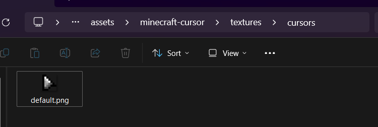
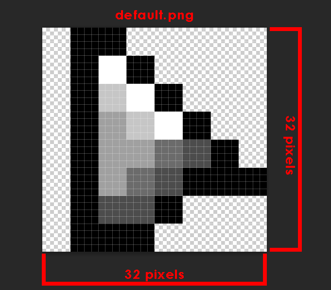
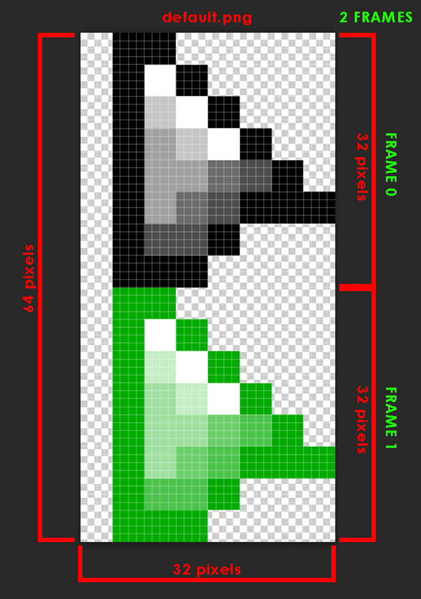
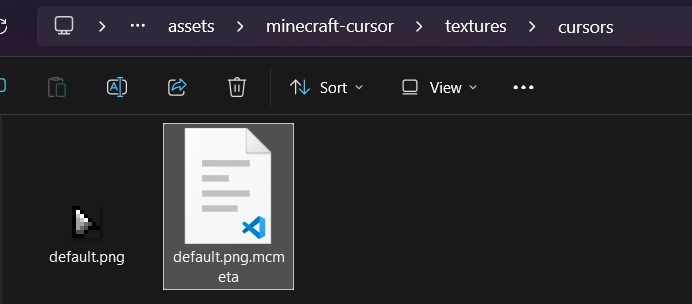
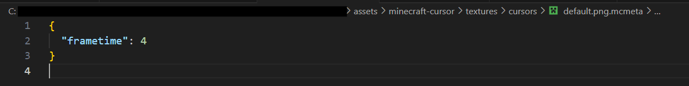

# Creating Cursor Textures

Cursor textures must meet the following requirements:
- Size: **32x32** pixels (strict)
- Format: `.png`

The file name of the texture must match the [cursor key](getting-started.md#all-cursors) you want to retexture. 

## Example

To retexture the Default cursor (key: `default`), name the texture file `default.png`.


<br><br>


## Animated Textures

1. To create animated textures, start with the standard 32x32 cursor texture. This will be the start of the sprite sheet.
   - This also serves as the fallback cursor when the user disables the animation of the cursor or if the animation data fails to load.

    <br>
    

2. Add frames by expanding the image downwards. Each frame is just another 32x32 cursor texture. 
   - The entire image height must be divisible by 32 pixels, while the width must remain 32 pixels.
   - Frames are identified by their index starting at 0, meaning the first frame is identified as frame `0`, the next frame as frame `1`, and so on.
   - There is no set limit to how many frames you can add. 

    <br>
     

3. Register the texture as an animated texture by adding a `<key>.png.mcmeta` file. Here is where you can also add [animation data](#animation-data).

    
   <br><br><strong><code>default.png.mcmeta</code></strong>:
   

### Animation Data
The existence of the `<key>.png.mcmeta` file tells **Minecraft Cursor** that `<key>.png` is an animated texture. It also specifies the animation data. 

It is in JSON format and can be opened with any text editor, preferably code editors like Notepad++ to aid with formatting.

<table>
  <thead>
    <tr>
      <th>Key</th>
      <th>Type</th>
      <th>Default</th>
      <th>Description</th>
    </tr>
  </thead>
  <tbody>
    <tr>
      <td><code>mode</code>&nbsp;<sup>optional</sup></td>
      <td><code>String</code></td>
      <td><code>loop</code></td>
      <td>
        <p>Determines the animation mode.</p>          
        <table>
          <thead>
            <tr><th colspan="2" align="left">Animation Modes</th></tr>
            <tr>
              <th>Name</th>
              <th>Description</th>
            </tr>
          </thead>
          <tbody>
            <tr>
              <td><code>loop</code></td>
              <td>Repeats in a continuous loop. The default mode.</td>
            </tr>
            <tr>
              <td><code>loop_reverse</code></td>
              <td>Repeats in a continuous loop but in reverse.</td>
            </tr>
            <tr>
              <td><code>forwards</code></td>
              <td>Plays the animation and stops at the last frame.</td>
            </tr>
            <tr>
              <td><code>reverse</code></td>
              <td>Plays the animation in reverse and stops at the first frame.</td>
            </tr>
            <tr>
              <td><code>oscillate</code></td>
              <td>Loops back and forth continuously.</td>
            </tr>
            <tr>
              <td><code>random</code></td>
              <td>Randomly selects frames in a loop. Does not repeat the same frame twice.</td>
            </tr>
            <tr>
              <td><code>random_cycle</code></td>
              <td>Randomly selects frames in a loop, cycling through all frames before repeating.</td>
            </tr>
          </tbody>
        </table>
      </td>
    </tr>
    <tr>
      <td><code>frametime</code>&nbsp;<sup>optional</sup></td>
      <td><code>int</code></td>
      <td><code>1</code></td>
      <td>The amount of ticks per frame. Minimum value: <code>1</code>.</td>
    </tr>
    <tr>
      <td><code>frames</code>&nbsp;<sup>optional</sup></td>
      <td><code>Array</code></td>
      <td><code>null</code></td>
      <td>
        <p>Determines the order and/or time of the frames to be played.</p>
        <ul>
          <li>If this is <code>null</code>, then the frames will be auto-generated based on the sprite sheet and the given <code>frametime</code>.</li>
          <li>Array elements can either be an <strong><code>int</code></strong> or a <strong><code>Frame</code></strong> object.</li>
        </ul>
        <table>
          <thead><tr><th><code>int</code></th></tr></thead>
          <tbody><tr><td>Specifies the index of the frame on the sprite sheet starting at <code>0</code></td></tr></tbody>
        </table>
        <table>
          <thead>
            <tr><th colspan="3" align="left">Frame</th></tr>
            <tr>            
              <th>Key</th>
              <th>Type</th>
              <th>Description</th>
            </tr>
          </thead>
          <tbody>
            <tr>
              <td><code>index</code>&nbsp;<sup>required</sup></td>
              <td><code>int</code></td>
              <td>The index of the frame on the sprite sheet starting at <code>0</code>.</td>
            </tr>
            <tr>
              <td><code>time</code>&nbsp;<sup>required</sup></td>
              <td><code>int</code></td>
              <td>The <code>frametime</code> of the frame. Minimum value: <code>1</code>.</td>
            </tr>
          </tbody>
        </table>
      </td>
    </tr>
  </tbody>
</table>

**Example usage**:
```json:line-numbers [&lt;key&gt;.png.mcmeta]
{
  "mode": "loop",
  "frametime": 1,
  "frames": [{ "index": 0, "time": 2 }, 1, 2, 3, 2]
}
```

### Limitations

- To maximize mod compatibility, interpolation is not feasible as the cursors are not being custom rendered. **Minecraft Cursor** simply changes the look of the native cursor, with each frame essentially being its own cursor.
- **Minecraft Cursor** relies on Minecraft's render loop which is based on the user's frame rate. If this is paused or slowed down, the animation will also pause or slow down.

## Practical Examples

For more examples, you can take a look at the built-in textures of **Minecraft Cursor** in the [source files](https://github.com/fishstiz/minecraft-cursor/tree/release/1.21.4/common/src/main/resources/assets/minecraft-cursor/textures/cursors).
